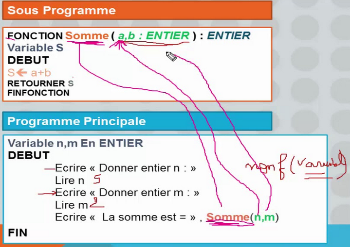
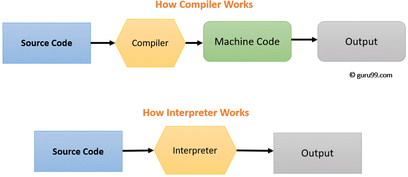

### Table des matières
**[Les fonctions](#Les fonctions)**</br>
**[Chaine de prodution d'un programme executable](#Chaine de prodution d'un programme executable)**</br>
**[Compilateur](#Compilateur)**</br>
**[Interpreteur](#Interpreteur)**</br>
**[Python instruction élémentaires](#Python instruction élémentaires)**</br>


# **Les fonctions**
**Définiton** : C'est un emsemble d'instruction isolées dans un bloc, qui réalise un traitement bien précis.

- une fois définit l'on appellera cette fonction afin de l'executer
- une fonction represente un traitement réutilisable
- la fonction utilisent des variables locale (Uniquement accésible pour elle)
- un bloc de code inhérte, activer uniquement quand on l'appelle



La fonction calcule de surface (long, lar)

Donné d'entrer ---> | Fonction (paramétre) | --> fournit un resultats


# **Chaine de prodution d'un programme executable**

## Compilateur

Enoncé (CDC) --> Analyse Fonctionelle --> Algorithme --> Prog en C --> Compilation --> Fichier



## Interpreteur

Enoncé (CDC) --> Analyse Fonctionelle --> Algorithme -->  Prog Python --> Interpreteur (executable)

## Python instruction élémentaires

```python
a = 33	# Affectation de valeur
b = 200

def fonction ():	# Définition d'une fonction

input () 	# Saisie utilisateur

if b > a:	# Instruction conditionnelle
  print("b is greater than a")	# Afficher une valeur

for i in [0, 1, 2, 3]: # Boucle for "Pour ..."
    print("i a pour valeur", i)

while condition:	# Boucle while "Temp que ..."
    Instruction A
```
**La boucle while**
